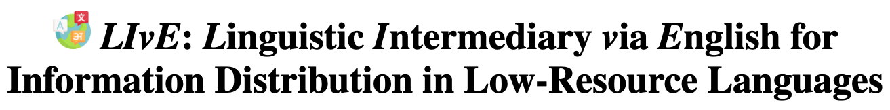
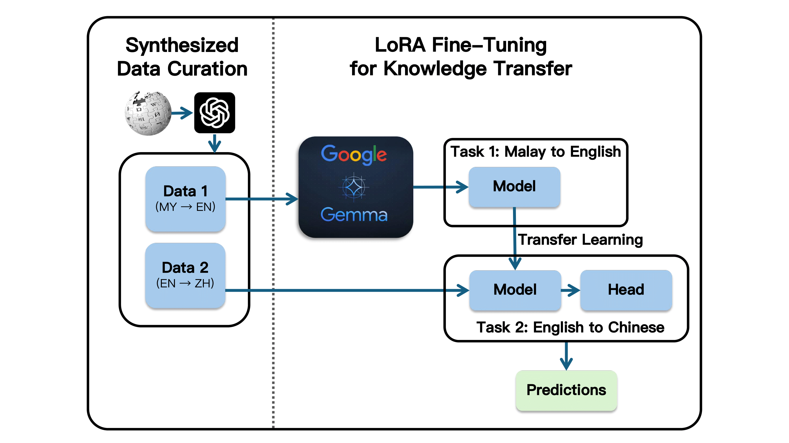
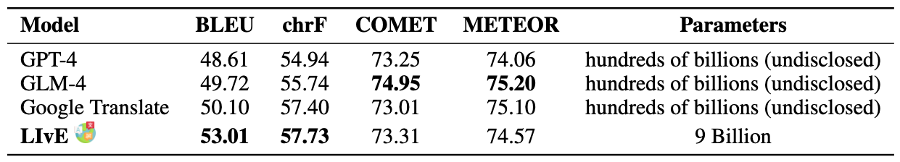
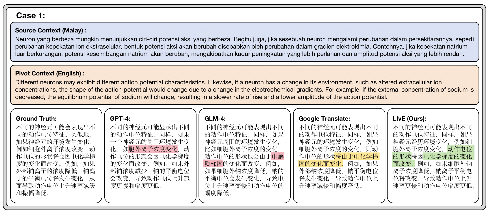

  

## Introduction

The **Linguistic Intermediary via English (LIvE)** framework leverages English as a pivot language in a Multilingual Neural Machine Translation (MNMT) system to enhance translation between low-resource languages, particularly in scientific domains like Neurobiology. Built on Google’s **GEMMA 2-9B** model, the framework employs supervised fine-tuning with LoRA for efficiency, following a three-stage process to optimize translations and develop direct low-resource language pair models. The framework follows a three-stage process: translating from a source low-resource language to English, refining translations from English to a target low-resource language, and developing a direct MNMT model for source-to-target translation.  With a curated domain-specific dataset and synthetic data, LIvE achieves superior performance, outperforming state-of-the-art models with hundreds of billions of parameters, showcasing its potential to democratize access to scientific knowledge and adapt to diverse low-resource languages and domains.

 

## LIvE Architecture

  

To address the challenges of translating between low-resource languages, we implement a multilingual architecture that leverages English as a pivot language. This approach capitalizes on the model's strong alignment with English, which serves as an intermediary to bridge the linguistic gap between source and target low-resource languages. The architecture employs a three-stage process: **(1)** translation from the source low-resource language to English, **(2)** translation from English to the target low-resource language, and **(3)** direct translation between low-resource languages using a Multilingual Neural Machine Translation (MNMT) model fine-tuned for this purpose. 

The fine-tuned model integrates synthesized datasets and LoRA adaptations to enable high-quality translation between low-resource language pairs. By using English as a pivot language, the model facilitates seamless knowledge transfer across languages, achieving efficient and accurate translations. Predictions are generated by leveraging the curated datasets and LoRA-optimized Gemma model, resulting in high translation accuracy with significantly reduced computational demands compared to traditional large-scale training.

 

## Result and Case Study

  

The LIvE framework, utilizing the Gemma-9B model with only 9 billion parameters, outperformed state-of-the-art models in key metrics such as BLEU (53.01) and chrF (57.73). Notably, LIvE surpassed GPT-4, GLM-4, and Google Translate, all of which have significantly larger model sizes (hundreds of billions of parameters). Although LIvE showed slightly lower scores in COMET (73.31) and METEOR (74.57) compared to some models, its performance remained highly competitive. This comparative analysis highlights the efficiency and effectiveness of LIvE’s pivot-based translation framework, which delivers superior results with significantly fewer parameters. The results confirm the model's adaptability to domain-specific tasks, achieving high-quality translations in Neurobiology while maintaining general-purpose translation capabilities.

 

The figure above ilustrates a comparative evaluation of translations produced by various models using English as a pivot language to translate from Malay to Chinese. Corect translations preserve the scientific terminology and context from the original sentence, such as "电化学梯度" (electrochemical gradient) and "钠离子的平衡电位" (equilibrium potential of sodium ions). Errors are marked in red, highlighting deviations like substituting "电化学梯度" with "电解质梯度"(electrolyte gradient), which misrepresents the scientific meaning in terms of Neurobiology. The highlighted translations from GPT-4 and GLM-4 demonstrate high fluency but occasionally lose precision, while Google Translate maintains accuracy but lacks natural readability. **LIvE (Ours)** achieves a balanced translation. ensuring both fluency and fidelity to the original scientific context.

 

## Domain-Specific Insights

<h4 style="color:grey; font-style:italic;">Handling Rare Terms and Technical Vocabulary.</h4>

One of the primary challenges in domain-specific translation is the accurate handling of rare terms and technical vocabulary that are often underrepresented in standard training datasets. Our approach, leveraging English as a pivot language, provides a significant advantage in this aspect. By fine-tuning the Gemma model first for translations into English, a language with extensive linguistic and domain-specific resources, the model gains a robust understanding of the source language's semantic and syntactic structures. Subsequently, fine-tuning for translation from English to the target language allows the model to transfer this knowledge effectively. This two-step process ensures that rare and complex terms in Neurobiology, such as “synaptic plasticity,” “neurogenesis,” or “axon guidance,” are accurately mapped between languages, maintaining their scientific integrity.
Direct translation methods often suffer from poor performance when encountering such terms due to the lack of sufficient training data and contextual grounding. The pivot-based approach mitigates this limitation by using English as a bridge, where these terms are more likely to be well-represented in existing corpora and understood by the model.

<h4 style="color:grey; font-style:italic;">Addressing Linguistic and Contextual Nuances.</h4>

Scientific content in Neurobiology often involves complex sentence structures, nuanced meanings, and context-dependent interpretations. For example, terms like "action potential" or "ion channel" can have different implications depending on the surrounding context. Direct translation models, particularly for low-resource languages, often struggle to capture these nuances due to limited exposure to domain-specific content in both source and target languages. By contrast, our method benefits from the pivot language’s rich contextual resources, enabling the model to encode these nuances during the intermediate translation step. The use of synthetic data augmentation further enhances the model’s exposure to domain-specific variations, ensuring robustness in handling diverse linguistic constructs.

<h4 style="color:grey; font-style:italic;">Adaptability to Low-Resource Languages.</h4>

The pivot-based methodology’s adaptability to low-resource languages is another critical factor contributing to its success in domain-specific contexts. Direct translation models often fail to bridge the gap between two low-resource languages due to the scarcity of parallel data. By introducing English as a high-resource pivot, our method facilitates knowledge transfer between low-resource languages, effectively utilizing the wealth of linguistic and domain-specific information available in English. This transfer learning process ensures that even low-resource language pairs benefit from a rich intermediary representation, enhancing translation quality significantly.